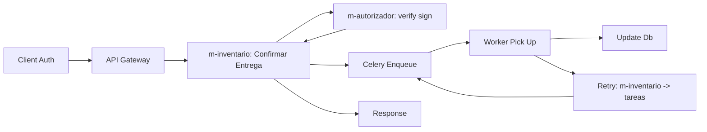

# MISW4202 - Microservicios con Docker

Este proyecto incluye una arquitectura de microservicios con Flask, Angular, Redis y Celery desplegados con Docker Compose.

## Arquitectura

La aplicación está dividida en microservicios independientes con una arquitectura Celery completamente desacoplada:

- **Frontend**: Aplicación Angular servida con Nginx
- **Microservicio Logística/Inventario**: API Flask en puerto 5002 (`microservices/logistica_inventario/`)
- **Microservicio Monitor**: Servicio de monitoreo en puerto 5001 (`microservices/monitor/`)
- **Redis**: Broker de mensajería para Celery
- **Celery Worker**: Procesador de tareas asíncronas (instancia separada)
- **Celery Flower**: Monitor web de Celery en puerto 5555
- **SQLite**: Base de datos como volumen compartido

### Arquitectura de Tareas Asíncronas

- **Worker Celery**: `celery_worker.py` - Auto-discovery y ejecución de tareas
- **Client Celery**: `celery_client.py` - Dispatch desde microservicios Flask
- **Task Registry**: `task_registry.py` - Metadata sin acoplamiento de código
- **Task Dispatcher**: `celery_app/dispatcher.py` - Interface limpia para envío

## Estructura del Proyecto

```
MISW4202/
├── shared/                      # Configuración compartida Flask (sin Celery)
│   ├── __init__.py             # Funciones: create_app, add_health_check, setup_cors
│   └── flask_config.py         # Importaciones simplificadas
├── microservices/
│   ├── logistica_inventario/    # Microservicio principal
│   │   ├── __init__.py         # Exporta app
│   │   ├── app.py              # Flask app usando shared config
│   │   ├── tasks.py            # Tareas asíncronas registradas con worker_celery
│   │   ├── modelos/
│   │   └── vistas/
│   └── monitor/                 # Microservicio monitor
│       ├── __init__.py         # Exporta app
│       ├── monitor_service.py  # Flask app usando shared config
│       └── tasks.py            # Tareas de monitoreo
├── entrypoint_logistica.py      # Entry point para logística
├── entrypoint_monitor.py        # Entry point para monitor
├── celery_app/                  # Configuración de Celery
│   ├── worker.py                # Celery worker con auto-discovery
│   ├── client.py                # Celery client para dispatch
│   ├── dispatcher.py            # Interface limpia para envío
│   └── task_registry.py         # Registry de tareas disponibles
├── entrypoints/                 # Puntos de entrada microservicios
│   ├── entrypoint_logistica.py  # Entrada logística
│   ├── entrypoint_monitor.py    # Entrada monitor
│   └── entrypoint_template.py   # Template para nuevos servicios
├── frontend/                    # Aplicación Angular
├── docker-compose.yml
├── Dockerfile                   # Imagen compartida
└── requirements.txt
```

## Instalación y Ejecución

### Prerequisitos

- Docker
- Docker Compose

### Ejecutar la aplicación

```bash
# Construir y ejecutar todos los servicios
docker-compose up --build

# Ejecutar en segundo plano
docker-compose up -d --build
```

### Servicios Disponibles

- **Frontend**: <http://localhost:4200>
- **API Logística/Inventario**: <http://localhost:5002>
- **API Monitor**: <http://localhost:5001>
- **Celery Flower**: <http://localhost:5555>
- **Redis**: localhost:6379

### Comandos Útiles

```bash
# Ver logs de todos los servicios
docker-compose logs

# Ver logs de un servicio específico
docker-compose logs m-logistica-inventario

# Ver logs del worker Celery
docker-compose logs celery-worker

# Detener todos los servicios
docker-compose down

# Detener y eliminar volúmenes
docker-compose down -v

# Reconstruir un servicio específico
docker-compose up --build m-logistica-inventario

# Verificar estado de todas las colas
docker exec $(docker ps --filter "name=celery-worker" -q) celery -A celery_worker inspect active
```

### Endpoints de API

#### Logística/Inventario (puerto 5002)
- `GET /health` - Health check
- `GET /tareas` - Lista de tareas disponibles 
- `POST /tareas` - Enviar tarea asíncrona
- `GET /tareas/<task_id>` - Estado de tarea específica

#### Monitor (puerto 5001)
- `GET /health` - Health check
- `GET /monitor/status` - Estado general de los servicios
- `GET /monitor/queue` - Información de las colas de Celery
- `GET /monitor/workers` - Información de los workers activos

## Arquitectura de Microservicios

### Logística/Inventario (`m-logistica-inventario`)

- **Puerto**: 5002
- **Entry Point**: `entrypoint_logistica.py`
- **Comando**: `python entrypoint_logistica.py`
- **Funcionalidad**: Gestión de entregas, autenticación, dispatch de tareas
- **Tareas**: `logistica.procesar_entrega`, `logistica.validar_inventario`, `logistica.generar_reporte`

### Autorizador (`m-autorizador`)

- **Puerto**: 5003
- **Entry Point**: `entrypoint_autorizador.py`
- **Comando**: `python entrypoint_autorizador.py`
- **Funcionalidad**: Autentica y permite firmar Peticiones de los usuarios

### Monitor (`m-monitor`)

- **Puerto**: 5001
- **Entry Point**: `entrypoint_monitor.py`
- **Comando**: `python entrypoint_monitor.py`
- **Funcionalidad**: Monitoreo de Redis, Celery y estado de servicios
- **Tareas**: `monitor.health_check`, `monitor.log_activity`, `monitor.generate_metrics`

### Celery Worker (`celery-worker`)

- **Entry Point**: Worker Celery separado
- **Comando**: `celery -A celery_worker.worker_celery worker --loglevel=info -Q celery,logistica,monitor`
- **Funcionalidad**: Procesamiento de tareas asíncronas con auto-discovery
- **Colas**: Escucha múltiples colas (celery, logistica, monitor)

### Celery Flower (`celery-flower`)

- **Puerto**: 5555
- **Entry Point**: Monitor Celery
- **Comando**: `celery -A celery_worker.worker_celery flower --port=5555`
- **Funcionalidad**: Monitor web de Celery

## Desarrollo Local (Alternativo)

Para activar el venv en desarrollo local:

```powershell
.\venv\Scripts\Activate.ps1
```

## Variables de Entorno

## Configuración de Arquitectura

### **📦 Configuración Compartida (`shared/`)**

El módulo `shared` proporciona funciones reutilizables para Flask (sin Celery):

- **`create_app(service_name, config_overrides)`**: Crea una app Flask configurada
- **`add_health_check(app, service_name)`**: Agrega endpoint `/health`
- **`setup_cors(app, origins)`**: Configura CORS

### **🔧 Arquitectura de Tareas Asíncronas:**

- **`celery_worker.py`**: Worker con auto-discovery de tareas (sin Flask)
- **`celery_client.py`**: Client para dispatch desde Flask
- **`task_registry.py`**: Registro de metadatos sin acoplamiento
- **`celery_app/dispatcher.py`**: Interface limpia para envío de tareas

### **🚀 Cómo agregar un nuevo microservicio:**

1. **Crear la carpeta**: `microservices/mi_nuevo_servicio/`

2. **Crear el app.py**:

   ```python
   from shared import create_app, setup_cors, add_health_check
   
   app = create_app('mi_nuevo_servicio')
   setup_cors(app)
   add_health_check(app)
   
   @app.route('/mi-endpoint')
   def mi_endpoint():
       return {'mensaje': 'Hola desde mi nuevo microservicio'}
   ```

3. **Si necesitas tareas asíncronas, crear tasks.py**:

   ```python
   from celery_app.worker import worker_celery
   
   @worker_celery.task(name='mi_servicio.mi_tarea')
   def mi_tarea_async(data):
       # Tu lógica aquí
       return {'resultado': 'procesado', 'data': data}
   ```

4. **Actualizar task_registry.py**:

   ```python
   TASK_REGISTRY = {
       # ... tareas existentes
       'mi_servicio.mi_tarea': {
           'description': 'Procesa datos del nuevo servicio',
           'params': ['data'],
           'queue': 'mi_servicio'
       }
   }
   ```

5. **Crear entry point**: `entrypoint_mi_servicio.py`

6. **Agregar al docker-compose.yml**

7. **Crear entry point**: `entrypoint_mi_servicio.py`

8. **Actualizar celery_worker.py** para auto-discovery:

   ```python
   # Agregar tu microservicio a la lista
   worker_celery.autodiscover_tasks([
       'microservices.logistica_inventario.tasks',
       'microservices.monitor.tasks',
       'microservices.mi_nuevo_servicio.tasks',  # ← Nuevo
   ])
   ```

## Variables de Entorno

Ver `.env.example` para las variables de entorno disponibles.

## Flow of Request


